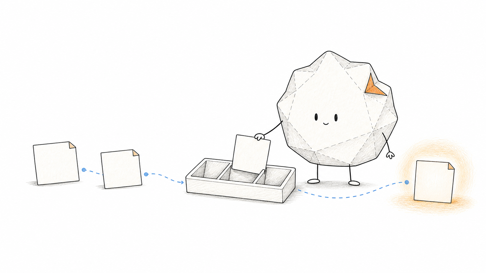

# Knowledge Base Illustrator



一个面向 Codex 的知识库插画 Skill：把笔记、概念和流程转化为有观点、有物理隐喻、有手写批注层级的正文解释图，并用原创“软褶纸团”角色保持长期一致。

## 能做什么

- 从知识笔记中提炼一个核心结论和一个物理隐喻。
- 使用橙色主流程、红色判断和蓝色补充形成正文批注层级。
- 让软褶纸团操作低科技装置、搬运输入或接住输出，而不是站在旁边装饰。
- 生成适合 Obsidian、Wiki 与技术文档的横版或方形插画。
- 按固定角色规范检查轮廓、褶皱、五官和手脚结构。
- 对现有位图进行严格局部修复，并验证目标区域外是否发生变化。
- 在不生成新图时，仅执行插画质量检查。

## 项目结构

```text
.
├── README.md
├── assets/
│   └── knowledge-base-illustrator-hero.png
└── knowledge-base-illustrator/
    ├── SKILL.md
    ├── agents/openai.yaml
    ├── assets/
    │   ├── reference/
    │   ├── style-grammar-reference/
    │   └── examples/
    ├── references/
    └── scripts/verify_image.ps1
```

`knowledge-base-illustrator/` 是可直接安装的 Skill 目录；角色参考板已经随项目提供，不依赖私人知识库路径。

## 安装

将 `knowledge-base-illustrator` 文件夹复制到目标项目：

```text
<your-project>/.agents/skills/knowledge-base-illustrator/
```

或复制到 Codex 个人 Skill 目录：

```text
%USERPROFILE%\.codex\skills\knowledge-base-illustrator\
```

重新启动 Codex 后，可用以下方式调用：

```text
使用 $knowledge-base-illustrator 为这篇笔记生成一张知识库插画。
```

## 使用方式

Skill 支持三种模式：

1. **Generate**：从笔记、段落、概念或流程生成新插画。
2. **Localized edit**：只修复指定区域，并保持区域外内容不变。
3. **Validate**：检查现有插画，不修改文件。

生成位图时依赖 Codex 内置的 `imagegen` Skill。项目会约束构图、角色身份、四肢数量、留白、颜色和验收流程，但不会把模型首次输出直接视为合格结果。

## 角色原则

- 象牙白软褶纸团，约七个主要褶面。
- 右上固定橙色折角。
- 小竖椭圆眼睛和极小居中嘴巴。
- 每个完整角色固定两条细线手臂、两条腿。
- 白底、大留白、黑色松弛手绘线。
- 橙色表达主流程，红色表达问题与判断，蓝色表达结果与回顾。
- 温暖但不软弱；可以认真操作装置，不抢夺知识内容的视觉主位。

## 校验

修改 Skill 后运行 Codex 官方 `quick_validate.py`。严格局部编辑后运行：

```powershell
.\knowledge-base-illustrator\scripts\verify_image.ps1 `
  -ImagePath .\after.png `
  -BaselinePath .\before.png `
  -TargetX 100 -TargetY 100 -TargetWidth 300 -TargetHeight 200
```

脚本会检查画布尺寸、目标区域外变化像素数和差异包围盒。

## 项目状态

当前为 `active`：核心流程、参考板、视觉语法、局部差异校验和真实生图闭环均已完成，仍会根据后续失败样本持续完善。

## 说明

角色和参考板为本项目原创视觉资产。仓库当前未附加开源许可证；在明确授权方式前，请勿将角色资产用于商业发行或二次授权。
